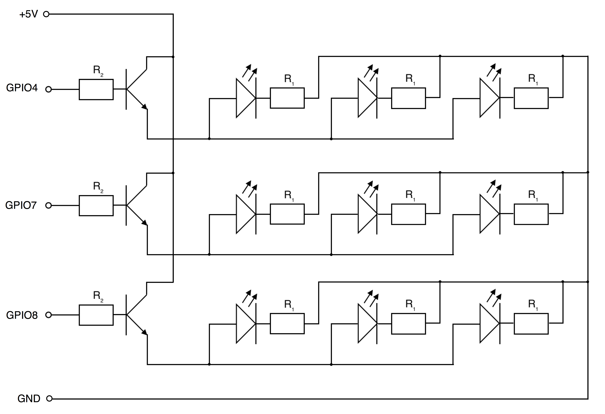

# iOSRaspiControl
### Clone
`git clone --recursive https://github.com/ph1ps/iOSRaspiControl.git`
##### This clones all submodules and the repository
### Install dependencies and start backend
```shell
cd ./NodeRoot
npm install
node index.js
```
### Schaltplan:
<b>R<sub>1</sub></b> = 270Ω <br>
<b>R<sub>2</sub></b> = 820Ω <br>

